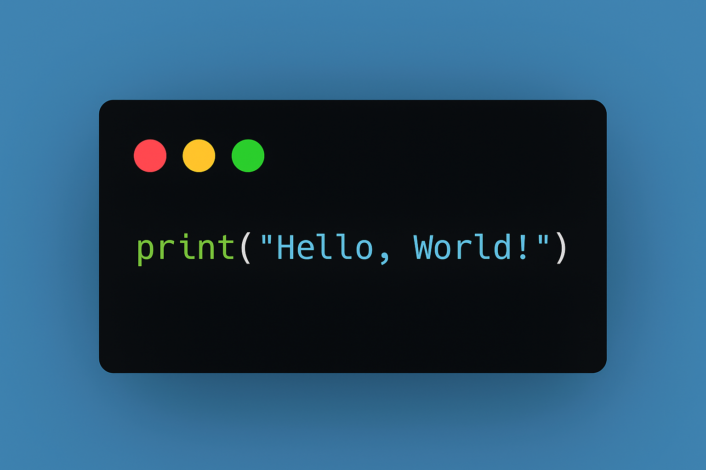

  

# Hey! Nice to see you 👋

### 🧑‍💻 About Me 
🎓 &nbsp;I hold a Bachelor's degree in Computer Science from [Warsaw University of Technology](https://eng.pw.edu.pl/).\
🏢 &nbsp;I’m currently working as a Senior Software Engineer at [Plentific, London](https://www.plentific.com/).\
🚀 &nbsp;I have hands-on experience building scalable systems with Python, Django, Celery, Docker, PostgreSQL, Redis, AWS, and more.\
🎯 &nbsp;My current goals include improving system observability, designing fault-tolerant distributed systems, and sharing more of my work with the open-source community.

---

### 📊 Contributions (Personal + Work)

  
  
  
  

  <b>Stats represent a combination of personal and work contributions (anonymized where necessary).</b>  

  🔗 <a href="https://github.com/sammyPlentific" target="_blank">Work Github Profile</a>

---

### 🌱 Fun fact  
🌍 I love traveling and experiencing different cultures whenever I can.
